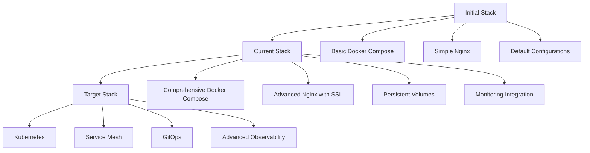

# DevOps Journey - Vita Strategies Platform

## Project Evolution Timeline

### Phase 1: Initial Deployment (July 2025)
**Goal**: Deploy basic microservices stack
**Duration**: 2 weeks
**Status**: ✅ Complete

#### Accomplishments
- [x] Docker containerization of all services
- [x] Basic nginx reverse proxy setup
- [x] Service discovery configuration
- [x] Initial database setup
- [x] Basic networking between services

#### Challenges Faced
- ERPNext complexity with asset serving
- Database connection issues between containers
- Container networking configuration
- Service startup dependencies
- Resource allocation optimization

#### Lessons Learned
- ERPNext requires specialized knowledge for production deployment
- Container networking needs careful IP address management
- Static asset serving is critical for web applications
- Database initialization order matters for dependencies

### Phase 2: Configuration Refinement (August 2025)
**Goal**: Stabilize configurations and fix critical issues
**Duration**: 1 week
**Status**: 🔄 In Progress

#### Current Work
- [x] Fix empty configuration files
- [x] Implement comprehensive docker-compose.yml
- [x] Create production-ready nginx configuration
- [x] Add persistent volume management
- [x] Document installation procedures
- [ ] Optimize ERPNext static asset serving
- [ ] Implement proper SSL certificate management
- [ ] Add comprehensive monitoring
- [ ] Create automated backup procedures

#### Technical Debt Identified
- Empty configuration files causing deployment issues
- Inconsistent service configurations
- Missing documentation for operational procedures
- No automated testing or validation
- Limited monitoring and observability

### Phase 3: Production Readiness (Planned - August 2025)
**Goal**: Make platform production-ready
**Duration**: 3-4 weeks
**Status**: 📋 Planned

#### Planned Features
- [ ] SSL/TLS implementation across all services
- [ ] Comprehensive monitoring with Prometheus
- [ ] Automated backup and recovery procedures
- [ ] CI/CD pipeline implementation
- [ ] Security hardening and vulnerability scanning
- [ ] Load testing and performance optimization
- [ ] Documentation completion
- [ ] Operational runbooks

#### Success Criteria
- All services pass health checks consistently
- SSL certificates auto-renewal working
- Backup/restore procedures tested and documented
- Monitoring alerts configured and tested
- Performance benchmarks established
- Security audit completed

### Phase 4: Scaling & Optimization (Planned - September 2025)
**Goal**: Optimize for scale and reliability
**Duration**: 4-6 weeks
**Status**: 📋 Planned

#### Planned Enhancements
- [ ] Kubernetes migration planning
- [ ] Database clustering and high availability
- [ ] CDN integration for static assets
- [ ] Advanced monitoring and alerting
- [ ] Auto-scaling implementation
- [ ] Disaster recovery testing
- [ ] Performance tuning
- [ ] Cost optimization

## Technical Evolution

### Architecture Decisions

#### Container Orchestration
- **Decision**: Start with Docker Compose
- **Rationale**: Simplicity for initial deployment
- **Future**: Migrate to Kubernetes for production scale

#### Database Strategy
- **Decision**: Individual databases per service
- **Rationale**: Service isolation and data ownership
- **Considerations**: Connection pooling and resource management

#### Networking Approach
- **Decision**: Custom bridge network with service discovery
- **Rationale**: Isolation and predictable networking
- **Challenges**: IP address management and DNS resolution

#### Storage Strategy
- **Decision**: Docker volumes with bind mounts for production
- **Rationale**: Data persistence and backup accessibility
- **Future**: Consider distributed storage solutions

### Technology Stack Evolution



### Performance Metrics Tracking

#### Baseline Measurements (Phase 1)
```
Service          Startup Time    Memory Usage    CPU Usage
ERPNext         60-90s          2-4GB          50-80%
Windmill        10-15s          1-2GB          10-20%
Metabase        20-30s          1.5-2.5GB     20-30%
Grafana         5-10s           500MB-1GB      5-15%
Mattermost      15-25s          1-2GB          15-25%
```

#### Target Performance (Phase 3)
```
Service          Startup Time    Memory Usage    CPU Usage
ERPNext         30-45s          1.5-3GB        30-50%
Windmill        5-10s           800MB-1.5GB    5-15%
Metabase        10-20s          1-2GB          15-25%
Grafana         3-8s            400-800MB      5-10%
Mattermost      10-20s          800MB-1.5GB    10-20%
```

## DevOps Practices Implementation

### Version Control Strategy
- **Main Branch**: Production-ready code
- **Develop Branch**: Integration of new features
- **Feature Branches**: Individual feature development
- **Hotfix Branches**: Critical production fixes

### CI/CD Pipeline Evolution

#### Current State
- Manual deployment
- Basic docker-compose validation
- Limited testing

#### Target State
```yaml
Pipeline Stages:
1. Code Quality
   - Linting
   - Security scanning
   - Dependency checking

2. Testing
   - Unit tests
   - Integration tests
   - End-to-end tests

3. Building
   - Container image building
   - Multi-architecture support
   - Image scanning

4. Deployment
   - Staging deployment
   - Automated testing
   - Production deployment
   - Rollback capability
```

### Infrastructure as Code

#### Current Approach
- Docker Compose files
- Configuration templates
- Manual environment setup

#### Target Approach
- Terraform for infrastructure provisioning
- Ansible for configuration management
- Helm charts for Kubernetes deployment
- GitOps with ArgoCD

### Monitoring Strategy Evolution

#### Phase 1: Basic Monitoring
- Docker health checks
- Basic resource monitoring
- Manual log review

#### Phase 2: Intermediate Monitoring
- Prometheus metrics collection
- Grafana dashboards
- Basic alerting

#### Phase 3: Advanced Monitoring
- Distributed tracing
- Application performance monitoring
- Predictive alerting
- SLA monitoring

## Team and Process Evolution

### Skills Development Journey

#### Initial Skills Gap
- Container orchestration
- Microservices architecture
- Production operations
- Security best practices

#### Current Skills Development
- Docker and containerization
- Nginx configuration
- Basic DevOps practices
- Infrastructure management

#### Target Skill Set
- Kubernetes administration
- Site reliability engineering
- Advanced monitoring and observability
- Security and compliance

### Process Maturation

#### Phase 1: Ad-hoc Operations
- Manual deployments
- Reactive problem solving
- Limited documentation

#### Phase 2: Structured Operations
- Documented procedures
- Standardized configurations
- Basic automation

#### Phase 3: Mature Operations
- Fully automated deployments
- Proactive monitoring
- Comprehensive documentation
- Incident response procedures

## Challenges and Solutions

### Technical Challenges

#### ERPNext Complexity
**Challenge**: ERPNext asset serving and configuration complexity
**Solution**: Specialized configuration and build process optimization
**Status**: Ongoing work required

#### Resource Management
**Challenge**: Services competing for limited resources
**Solution**: Resource limits and monitoring implementation
**Status**: Planned for Phase 3

#### Data Persistence
**Challenge**: Ensuring data survives container restarts
**Solution**: Persistent volume configuration and backup procedures
**Status**: Implemented with improvements planned

### Operational Challenges

#### Configuration Management
**Challenge**: Multiple configuration files and environments
**Solution**: Template-based configuration with environment variables
**Status**: In progress

#### Monitoring and Alerting
**Challenge**: Limited visibility into system health
**Solution**: Comprehensive monitoring stack implementation
**Status**: Planned for Phase 3

#### Backup and Recovery
**Challenge**: No automated backup procedures
**Solution**: Automated backup scripts and recovery testing
**Status**: High priority for Phase 3

## Future Roadmap

### Short-term Goals (Next 3 months)
1. Complete production readiness checklist
2. Implement comprehensive monitoring
3. Establish backup and recovery procedures
4. Security hardening and compliance
5. Performance optimization

### Medium-term Goals (3-6 months)
1. Kubernetes migration
2. Advanced monitoring and observability
3. Auto-scaling implementation
4. Disaster recovery capabilities
5. Cost optimization

### Long-term Goals (6-12 months)
1. Multi-region deployment
2. Advanced security features
3. Compliance certification
4. Advanced automation
5. Platform as a Service capabilities

## Success Metrics

### Technical Metrics
- **Uptime**: Target 99.9%
- **Response Time**: < 2 seconds average
- **Resource Utilization**: < 70% average
- **Deployment Time**: < 10 minutes
- **Recovery Time**: < 30 minutes

### Operational Metrics
- **Mean Time to Recovery**: < 1 hour
- **Change Failure Rate**: < 5%
- **Deployment Frequency**: Daily capability
- **Lead Time**: < 2 hours

### Business Metrics
- **User Satisfaction**: > 4.5/5
- **Feature Delivery**: Weekly releases
- **Cost Efficiency**: 20% reduction year-over-year
- **Security Incidents**: Zero tolerance

## Knowledge Management

### Documentation Strategy
- Architecture decision records
- Operational runbooks
- Troubleshooting guides
- Best practices documentation

### Training and Development
- Regular DevOps training sessions
- Industry certification pursuit
- Conference participation
- Internal knowledge sharing

### Community Engagement
- Open source contributions
- Technical blog writing
- Industry meetup participation
- Vendor relationship management

---

**Journey Status**: Phase 2 - Configuration Refinement
**Next Milestone**: Production Readiness Checklist Completion
**Expected Completion**: August 31, 2025